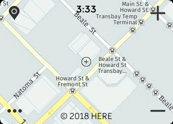

# Map app for Fitbit Ionic/Versa

Features:
- Choose being aerial, hybrid and standard view
- Pan around by swiping with your finger
- Zoom in/out with the right side buttons
- Show your current location with the top left button
- View latitude/longitude coordinates
- Requires a HERE Maps account (here.com)
- Direct link to app store (open with phone):
https://gam.fitbit.com/gallery/app/694767ad-eadb-437b-aa8c-faa181aab599
